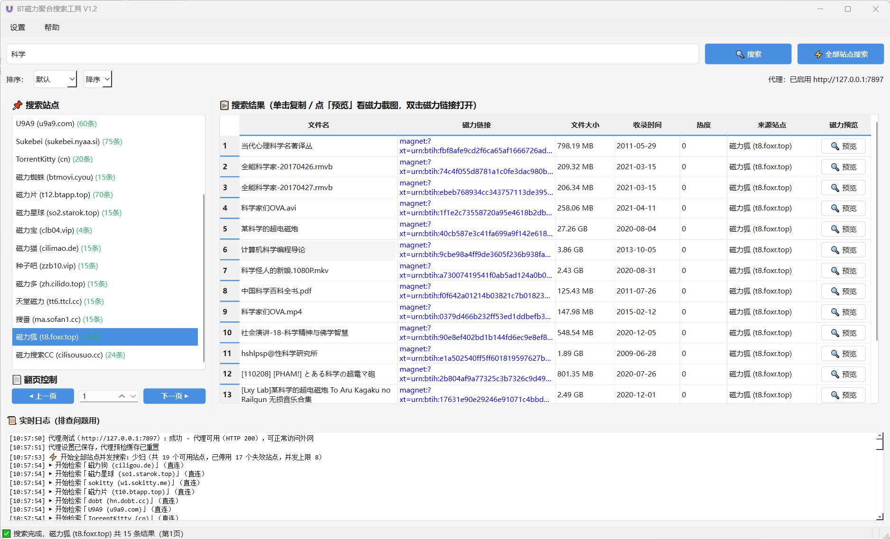
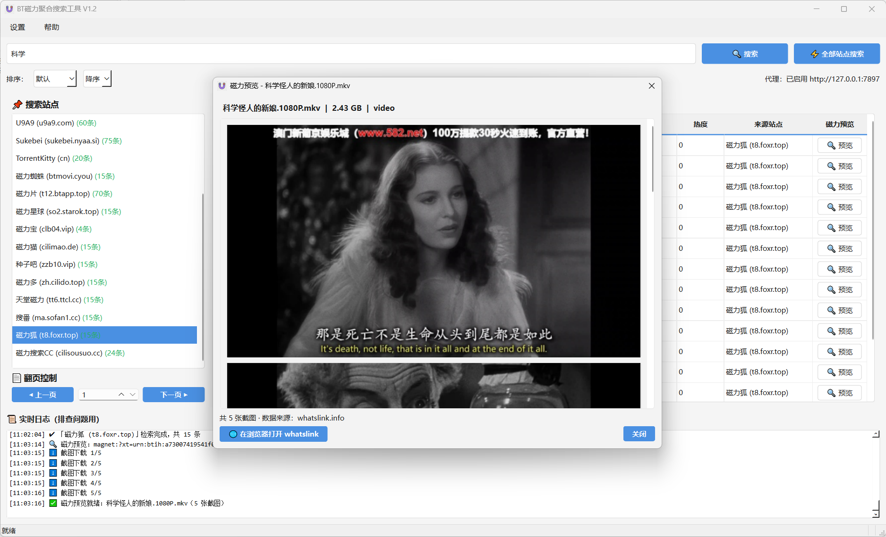

# BT 磁力聚合搜索工具

一个基于 **PyQt6** 的桌面端 BT / 磁力链接聚合检索工具。内置 40+ 站点配置，经实测精简为 **19 个启用站点** 并发检索、汇总结果，支持代理预检与智能回退、结果排序、实时日志排查、磁力截图预览。已打包为单文件 exe（见 [Releases](https://github.com/huyin324/BT-Aggregate-Search/releases)），开箱即用。

## 界面预览

**搜索界面**（多站点并发检索、命中条数绿色高亮、磁力预览按钮、实时日志）：



**磁力预览**（调用 [whatslink.info](https://whatslink.info/) 接口，弹窗展示磁力元数据与视频截图）：



---

## V1.1 更新说明

- **站点可用率大幅提升**：经全站自测（英文关键词），23 个启用站点 **100% 能返回数据**（此前仅约 20%）。
  - 修复 Brotli 压缩乱码：请求头不再声明 `br` 编码，避免未装 brotli 时收到二进制乱码。
  - 自动检测响应编码（GBK/UTF-8/EUC-JP 等），修复多站乱码导致解析为 0 条的问题。
  - 破解 iframe 前端站真实后端（如 cilimao、ttbt 系列），改用后端接口搜索。
  - 新增 cilisousuo_cc / zzb10 / ttcl / foxr 等解析器；禁用 17 个已失效域名站点。
- **nyaa.net 解析修复**：兼容其无 class 行结构（`td.col-name a.t-name` / `col-size` / `num-s`），恢复 75 条/页。
- **nyaa.net 中文关键词提示**：该站服务端拒绝中文关键词（503），工具会提前拦截并提示「仅支持英文/日文关键词」。

---

## V1.2 更新说明

- **代理预检**：启用代理后，检索前先自动探测代理可用性（TCP + 经代理外网请求双重验证，结果缓存 5 分钟）；预检不通过时本次检索仅直连，不再浪费代理重试时间。代理设置保存后自动重新预检。
- **矢量图标**：应用图标改用矢量 `磁力.svg`（运行时以 16–256 共 7 档尺寸渲染，缩放不失真）；exe 图标由该 SVG 重新生成。
- **磁力预览（whatslink.info）**：结果表新增「磁力预览」列，点击按钮自动调用 whatslink.info 接口获取磁力元数据与截图，在弹窗中滚动展示；新磁力解析中会自动轮询等待（最多 5 轮）；支持一键在浏览器打开 whatslink 页面。
- **站点精简（基于实测）**：以「白洁」「少妇」为关键词对全部启用站点实测，删除无法检索到含关键词内容的站点：
  - `nyaa_si` / `nyaa_net`：中文关键词 0 结果（nyaa 系为动漫索引站，中文资源不在其收录范围）；
  - `btlms`：任意关键词仅返回固定默认热榜（假搜索）；
  - `u001`：任意关键词（含乱码）返回同一 62 条固定列表（假搜索）。
  - 现启用 **19 个站点**，全部通过双关键词实测（每站返回结果标题均含关键词）。

---

## 一、功能特性

| 功能 | 说明 |
| --- | --- |
| **多站点并发聚合** | 一次性在全部启用站点并发检索，结果统一汇总到表格，左侧站点栏实时显示各站命中条数（绿色高亮）。 |
| **代理预检 + 智能回退** | 菜单「设置 → 代理设置」可配置协议（http/https/socks5）、地址、端口。启用后检索前先**自动预检代理可用性**（TCP + 外网请求双重验证，结果缓存 5 分钟）：预检通过时先直连、失败再用代理重试；预检不通过时本次仅直连。 |
| **与原站一致的每页条数** | 每个站点已按原站单页条目数配置 `page_size`（如 nyaa 75、torrentkitty 20、52BT/磁力妹妹/91BT 20、磁力片 50），不截断、不合并分页。 |
| **多维度排序** | 工具栏下拉支持按 **文件大小 / 收录时间 / 热度** 的 **升序 / 降序** 统一排序（客户端转换 `size_to_bytes` / `date_to_int` / `hot_to_int`）。 |
| **实时日志面板** | 底部白底日志框逐站打印：开始检索（直连）→ 直连失败改代理重试 → 完成 N 条 / 跳过，以及全局开始/完成、错误与状态变更，便于排查。 |
| **代理可用性自测** | 代理设置对话框内置「🔌 测试代理可用性」按钮：先做 TCP 连通性检查，再经该代理发一次外网请求，结果实时回显并写入日志。 |
| **磁力预览** | 结果表「磁力预览」列点击按钮，调用 [whatslink.info](https://whatslink.info/) 接口获取磁力元数据与视频截图，弹窗滚动展示；支持一键在浏览器打开。 |
| **矢量图标** | 应用图标为矢量 `磁力.svg`，运行时按 16–256 共 7 档尺寸渲染，任意缩放不失真。 |
| **反爬与性能优化** | 随机 User-Agent + 反爬请求头、随机微延迟；全部站点并发检索（最大 8 线程调度）；结果增量追加避免全表重建。 |

---

## 二、已集成站点（按解析模板归类；共 40+ 配置，实测启用 19 个）

| 模板 | 启用站点 |
| --- | --- |
| nyaa | sukebei.nyaa.si |
| torrentkitty | cn.torrentkitty.tv |
| zsky | 52BT（529076 / 529075）、磁力妹妹（9966109 / 9966108）、91BT（911178 / 911179 新域名） |
| btmovi | 磁力蜘蛛 btmovi.cyou |
| btapp / starok 新主机 | t12.btapp.top、t13.btapp.top、so1.starok.top、so2.starok.top |
| 通用尽力解析 | 磁力宝 clb04、磁力狗、dobt、w1.sokitty、磁力猫 cilimao、种子吧 zzb10、磁力多 cilido、天堂磁力 ttcl、沙发影视 sofan1、磁力狐 foxr、磁力搜索CC cilisousuo.cc、u9a9 |

> ⚠️ 说明：V1.2 以「白洁」「少妇」双关键词对全部站点实测，删除了无法检索到含关键词内容的站点（nyaa.si / nyaa.net 中文资源不在收录范围；btlms / u001 为固定热榜假搜索）。另有 17 个失效域名站点登记于 `DEAD_SITES` 自动停用。部分 JS 渲染 / 验证码站点的限制见 FAQ。

---

## 三、使用方法（各操作系统）

### 1. Windows（exe 直接运行，推荐）

从 [Releases](https://github.com/huyin324/BT-Aggregate-Search/releases) 下载 `BT-Aggregate-Search-V1.2.exe`，双击即可运行，**无需安装 Python**。

- 首次运行如遇 SmartScreen 提示，点「更多信息 → 仍要运行」（未做代码签名属正常提示）。
- 想从源码启动：安装 Python 3.10+ 后按下方通用步骤执行。

### 2. macOS

```bash
# 1) 安装 Python 3.10+（官方安装包或 Homebrew）
brew install python
# 2) 安装依赖
pip3 install PyQt6 requests beautifulsoup4 lxml
# 3) 运行
python3 BT磁力聚合搜索工具.py
```

- Apple Silicon（M 系列）与 Intel 均支持，PyQt6 官方轮子已含通用二进制。
- 首次运行如提示「无法验证开发者」，请在 系统设置 → 隐私与安全性 中放行（源码运行一般不涉及）。

### 3. Linux

```bash
# 1) 安装依赖（Debian / Ubuntu 及衍生版）
sudo apt install python3 python3-pip \
     python3-pyqt6 libgl1 libegl1 libxkbcommon0 libxcb-cursor0 \
     libxcb-icccm4 libxcb-keysyms1
# 或仅用 pip（需先装 python3-venv）：
pip3 install PyQt6 requests beautifulsoup4 lxml

# 2) 运行
python3 BT磁力聚合搜索工具.py
```

- Fedora / Arch 可用 `sudo dnf install python3-qt6` / `sudo pacman -S python-pyqt6` 替代第 1 步中的系统包。
- **无显示环境（SSH / 服务器）**：仅验证解析功能可用 `QT_QPA_PLATFORM=offscreen python3 BT磁力聚合搜索工具.py`，GUI 需要桌面环境或 X11/Wayland 转发。
- 若 PyQt6 pip 安装失败，优先使用系统包管理器的 qt6 版本（各发行版命名见上）。

### 4. 基本操作（通用）

1. 在顶部输入框输入关键词，点「🔍 搜索」检索**当前选中站点**；点「⚡ 全部站点搜索」并发检索**所有站点**。
2. 左侧站点栏点击可切换单站视图（「📊 全部站点」为汇总视图）；栏内「（N条）」为各站命中数（绿色）。
3. 工具栏「排序」下拉：默认 / 文件大小 / 收录时间 / 热度 × 降序 / 升序。
4. 结果表格：单击复制单元格；点「🔍 预览」查看该磁力的 whatslink 截图；**双击磁力链接**调用系统默认下载工具打开。
5. 菜单「设置 → 代理设置」配置代理（http/https/socks5），保存后自动预检可用性。

---

## 四、技术架构

- **GUI**：PyQt6（`QMainWindow` + 可拖拽 `QSplitter` 左右布局 + 底部日志面板）。
- **检索模型**：每个站点 = 一个配置字典 `{id, name, url, parser, page_size}` + 一个对应的解析函数（`parse_xxx`），解析函数与 GUI 解耦，可独立单测。
- **并发与线程安全**：每个站点一个 `SearchThread(QThread)`，所有跨线程信号显式使用 `Qt.ConnectionType.QueuedConnection` 投递到 GUI 线程（避免工作线程操作 GUI 控件导致的闪退），线程引用由 `self.threads` 持有、`finished` 时 `deleteLater` 回收。
- **代理回退**：`SearchThread.run()` 先做代理预检（`check_proxy_available()`，结果缓存 5 分钟），预检通过时先 `_attempt(None, False)` 直连、失败再 `_attempt(get_proxies(), True)` 走代理；预检不通过则仅直连；两次尝试均失败则 `finish_signal(0)` 标记跳过。
- **磁力预览**：`WhatslinkPreviewThread` 调用 whatslink.info 接口（新磁力自动轮询等待解析），截图以字节传回 GUI 线程构造 `QPixmap`，弹窗 `MagnetPreviewDialog` 滚动展示。
- **反爬**：随机 UA、`Sec-CH-UA` 等请求头、随机微延迟。

### 目录结构
```
BT磁力聚合搜索工具.py     # 主程序（GUI + 解析器 + 检索线程 + 磁力预览）
磁力.svg                  # 矢量图标源文件（窗口图标 + exe 图标生成源）
icon.ico                 # 由 磁力.svg 生成的多尺寸 exe 图标
kw_check.py              # 关键词实测脚本（站点质量评估）
make_icon.py             # SVG → icon.ico 生成脚本
parser_test.py           # 解析函数单测（基于保存的真实页面 HTML）
test_sites.py            # 全站实测脚本
headless_gui_test.py     # 无界面 GUI 构建校验
headless_batch_test.py   # 批量搜索不闪退 / 线程回收自测
headless_v12_test.py     # V1.2 专项自测（图标/预检/预览链路）
```

---

## 五、从源码构建 exe

Windows：
```bash
pip install pyinstaller
pyinstaller --onefile --windowed --name "BT磁力聚合搜索工具" ^
            --icon icon.ico --add-data "icon.ico;." --add-data "磁力.svg;." ^
            BT磁力聚合搜索工具.py
```

macOS / Linux（路径分隔符用 `:`）：
```bash
pyinstaller --onefile --windowed --name "BT磁力聚合搜索工具" \
            --icon icon.ico --add-data "icon.ico:." --add-data "磁力.svg:." \
            BT磁力聚合搜索工具.py
```
产物位于 `dist/BT磁力聚合搜索工具.exe`（Windows）/ `dist/BT磁力聚合搜索工具`（macOS/Linux）。

---

## 六、常见问题（FAQ）

- **为什么某些站点偶尔 0 结果？** 多为出口 IP 被站点限流 / 反爬，或对 JS 渲染 / 验证码类站点不支持。工具已自动跳过无数据站点；换用本机网络 / 自己的代理并以人工节奏使用通常可正常返回。
- **批量搜索闪退过，现在修复了吗？** 已修复：根因为跨线程信号被解析成直连、在工作线程操作 GUI 控件导致崩溃，已统一改为 `QueuedConnection` 并保活线程引用。
- **代理怎么配？** 菜单「设置 → 代理设置」，填协议 / 地址 / 端口后，可点「测试代理可用性」验证，再勾选「启用」。

---

## 七、免责声明

本工具仅用于聚合检索公开可访问的 BT / 磁力元数据，**不托管、不分发任何受版权保护的内容**。使用者须遵守所在国家 / 地区法律法规，因滥用造成的任何后果由使用者自行承担。
